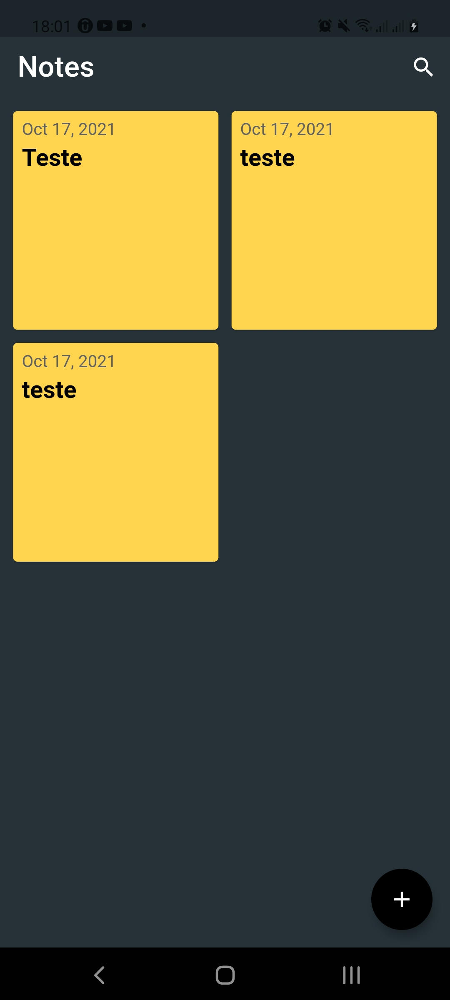

<h1 align="center">Notes APP</h1>
## Sobre

PT

Desenvolvimento de um aplicativo simples para fins de estudos da lib sqflite.


## Instalação

Faça o clone do projeto:
```bash
https://github.com/MaikonLima/notes_app.git
```
Abra o projeto em um editor de sua preferência
 - VS Code
 - Android Studio.

No terminal execute o seguinte comando para realizar a instalação da aplicação no android:
 - flutter run <NAME_APP>

## Telas da aplicação

<div class="box">
    
    <span> Tela 1</span>
</div>
<div class="box">
    
    <span> Tela 2</span>
</div>

<style>
div.box {
	width: 150px;
	display: inline-block;
}
</style>
